# Analysis of two encryption algorithms used by the Lazarus group

### _In this blog, I will analyze the encryption capabilities of a malware sample attributed to the North Korean APT group known as Hidden Cobra, or Lazarus._

  

  

## Introduction
  
In this blog, we will analyze the encryption capabilities of a malware sample attributed to the North Korean APT group known as **Hidden Cobra**. In particular, we will focus on its encryption capabilities, and we will analyze in deep the two encryption algorithms used by this sample.  
  
The (sha2-256) hash of the sample is  
  
`bdff852398f174e9eef1db1c2d3fefdda25fe0ea90a40a2e06e51b5c0ebd69eb`.  
  
This is a well known sample and it is indeed possible to find reports online. Reading these reports after analyzing the sample was useful to double check my findings and to get a better idea of the goals of the whole campaign.  
  
The most comprehensive report about this sample is from [**CISA**](https://www.cisa.gov/news-events/analysis-reports/ar21-048a). Reading this report, we learn that FBI, CISA, and the Department of Treasury attribute this malware campaign to the **Lazarus** group (aka **Hidden Cobra**).  
  
Authors also state that this sample is part of a trojanized application named **AppleJeus**, that pretends to be a legitimate trading application and whose goal is to steal cryptocurrencies to the victims. The sample makes use of a valid certificate, associated to the domain **celasllc\[.\]com** (we’ll encounter this domain later).  
  
Also, the authors mention the two encryption algorithms that we discuss later: the first one is a simple XOR-based encryption algorithm while the second one is a custom implementation of the **RC4** algorithm.  
  
In this [**blog post**](https://blogs.infoblox.com/cyber-threat-intelligence/cyber-threat-advisory/cyber-threat-advisory-hidden-cobra-applejeus-cryptocurrency-threats/) instead the authors track the evolution of the AppleJeus malware, highlighting its characteristics trough seven different versions.  
  
## Analysis of the sample
  
I will start with a basic static analysis of the PE header and then I will proceed with an advanced static analysis using IDA Pro. I will show only relevant parts and I will alternate between static and dynamic analysis with the debugger when this will help to clarify concepts.  
  
Opening the file with CFF Explorer, we see that this is a valid PE executable. The sample was written in C++, as we can see from the Compiler section. It is a 32 bit sample  

  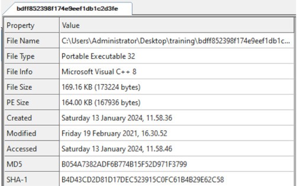

  

<i>Figure 1: file open in CFF Explorer</i>

Taking a look at the Characteristics, we see that it is an executable file, not a DLL.  

  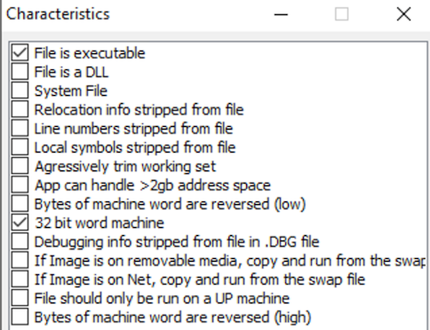 
  <i>Figure 2: Characteristics of the sample</i>

  
  

The sample is a GUI application (not a CLI app).  

   
  <i>Figure 3: GUI executable</i>

  

  

Let’s take a look at the sections now: we can find the standard sections, nothing strange is present. The sample is not packed with **UPX** (otherwise a UPX section would show up here) and we can notice that for each section, the virtual size is very close to the raw size.  

  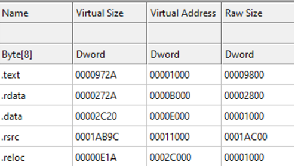 
  <i>Figure 4: sample sections</i>

    
  

The sample does not seem to be packed. To have further confirmation we take a look at the entropy of each section: all sections have low entropy indeed, with the only exception of the .text section, where entropy is approximately 6.5. If encrypted data or instructions are present, we expect them to be in this section.  

  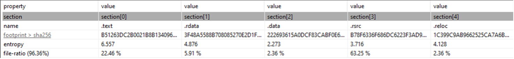 
  <i>Figure 5: entropy of sections</i>

    
  

Let’s take a look at the imported libraries.  
  
There are many imported functions, which indicates that functions are not resolved dynamically.  
If we make some raw groupings, just to get an idea at first glance of sample capabilities, we can see that there are:  
  
\- functions for HTTP communication, maybe used to contact the C2 server;  
\- functions used to get a list of current processes (`GetToolhelp32Snapshot`) and to iterate among such processes (and possibly to kill them);  
\- functions that deal with encryption (`Crypt…`).  
  
There are other interesting functions imported, for instance functions to get information about whether or not the system is run inside the WoW64 subsystem (this is indeed a 32 bit sample, that can be run on a 64 bit system) or functions used to check the presence of a debugger.  
  
However, I would’t go deeper with the analysis here: better check later in IDA Pro which ones are actually used and how.  

  

  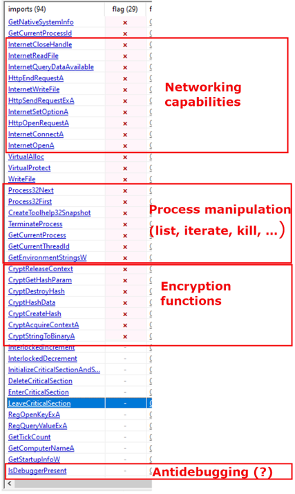 
  <i>Figure 6: imported functions</i>

  

  

Looking at plain strings found inside the file, we can see a hardcoded path that can represent a good host-based indicator: `Z:\jeus\downloader\downloader_exe_vs2010\Release\dloader.pdb`  
  
Program database (PDB) is a file format for storing debugging information about a program. They are commonly associated with programs written in C or C++ and are used in Microsoft Visual Studio.  
  
This may tell us that malware author developed this sample in C++ using Visual Studio. The fact that the hardcoded path is left in the executable may be a mistake made by malware authors, who did not sanitize properly the sample before delivering it.  
  

  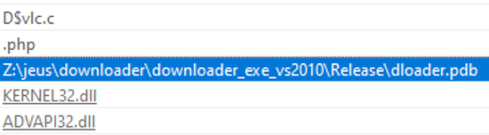 
  <i>Figure 7: strings inside the sample</i>

  

Let's start the analysis with IDA Pro.  
  
The first thing that catches my attention is the invokation of `GetCommandLineA` to retrieve the command-line string for the current process. After that, the sample pushes onto the stack the hex character `20` (corresponding to the blank space character) and the command-line string and then calls `_strrchr`.  
  
This function returns a pointer to the last occurrence of the provided character into the command-line string, if any. If such character is not found in the command-line string, then the function returns `NULL` and the sample simply jumps to `loc_402A5F` and terminates the execution.  
  

  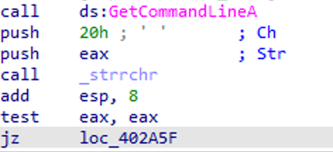 
  <i>Figure 8: GetCommandLineA</i>

  
  

Then next instructions check if the characters after the blank space in the command-line string are the following ones: `CheckUpdate`  
  

  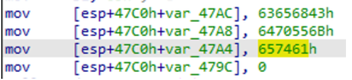 
  <i>Figure 9: CheckUpdate</i>

  

If that is the case the execution continues (the tool was run with the correct parameter) and the sample calls `GetTickCount` to compute the number of milliseconds since the system is running.  

  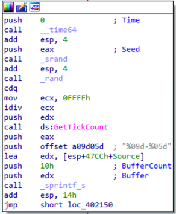 
  <i>Figure 10: GetTickCount</i>

  

  

The next interesting function is **SUB\_401000**, where the sample retrieves information about the current system.  
  
This function invokes `CreateToolhelp32Snapshot` passing dwFlags = 2 as parameter, which corresponds to `TH32CS_SNAPPROCESS`, to generate a snapshot of the system that includes all processes in the system.  
  

  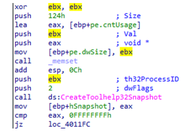 
  <i>Figure 11: CreateToolHelp32Snapshot</i>

    

If the function executed successfully, a handle to the created snapshot is returned. Then, `Process32First()` is called to retrieve information about the first process inside the snapshot. To do this, the `PROCESSENTRY32` structure is initialized and passed to `Process32First()`, together with the handle to the snapshot retrieved from `CreateToolhelp32Snapshot()`.  
  
At this point the sample iterates over all the processes in the sample and writes the name of each process found into memory. For instance, the first process name that is written to memory is **\[System Process\]**:  
  

  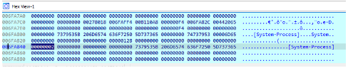 
  <i>Figure 12: first process name written to memory</i>

    

After the process name is written to memory, `Process32Next()` is called to get the next process in the snapshot. These operations are repeated inside a loop until all processes have been scanned.  
  

  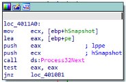 
  <i>Figure 13: Process32Next</i>

    

When the loop ends, the sample has dumped all process names, included itself ( _bdff852398f174e9eef1db1c2d3fefdda25fe0ea90a40a2e06e51b5c0ebd69eb_ ):  
  

  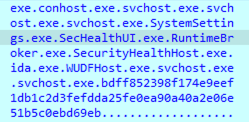 
  <i>Figure 14: dumped processes names</i>

    
  

The second thing that the sample retrieves and writes to memory, after the processes names, is the NETBIOS name of the computer:  

  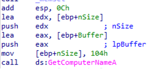 
  <i>Figure 15: GetComputerNameA</i>

   
  

  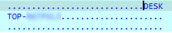 
  <i>Figure 16: NETBIOS name</i>

   

  

Finally, the third thing that the sample retrieves are some registry values.  
Indeed, `RegOpenKeyExA` is called to read (`samDesired` is 20119h, which means read access) the registry key `HKEY_LOCAL_MACHINE\\SOFTWARE\\Microsoft\\Windows NT\\CurrentVersion`:  
  

  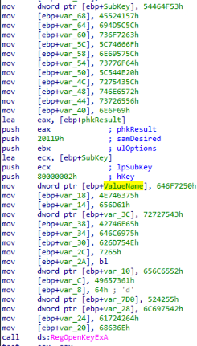 
  <i>Figure 17: RegOpenKeyExA</i>

   
 

At this point, five strings are created to query five registry values:  
  
\- `ValueName` is assigned the hardcoded string **ProductName**  
\- `Var_3C` is assigned the hardcoded string **CurrentBuildNumber**  
\- `Var_10` is assigned the hardcoded string **ReleaseId**  
\- `Var_7D0` is assigned the hardcoded string **UBR**  
\- `Var_28` is assigned the hardcoded string **BuildBranch**  
  
  

  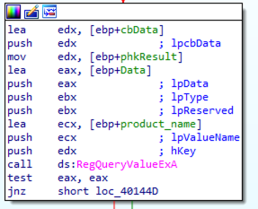 
  <i>Figure 18: RegQueryValueExA</i>

   
 

Just to show an example, here it is an iteration of the sample querying the registry value **ProductName** and storing it in memory. The retrieved value is `Windows 10 Pro`. This value is written at the address contained in `eax`, right after the process name and the computer name just restrieved. Also the other registry values will be added here:  
  

  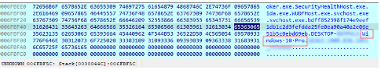 
  <i>Figure 19: OS version</i>

   

## Encryption #1: XOR-based
  
The next interesting functionality is the first encryption algorithm:  
  

  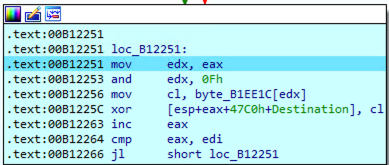 
  <i>Figure 20: XOR encryption</i>

  
  

`EAX` is initially set to zero and incremented until it reaches the value of `EDI`, which holds the number of bytes previously written by the sample (process names, hostname and registry values). The encryption is done here, and the key that is used is the one specified at `byte_B1EE1C`: **Moz&Wie;#t/6T!2y**  
  

  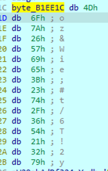 
  <i>Figure 21: encryption key</i>

  
  

The instruction  
  
`AND EDX, 0Fh`  
  
Is used to pick a character from this encryption key, in a round robin fashion. Indeed, since the maximum value that can be returned by this operation is 15, the result is this one:  
  
\- at the first iteration we pick the first char of the key (with index 0)  
  
\- at the second iteration we pick the second char of the key (with index 1)  
  
\- …  
  
\- at the sixteenth iteration we pick the sixteenth char of the key (with index 15)  
  
\- at the seventeenth iteration we pick the first char of the key (with index 0)  
  
and so on, wrapping around every time we hit a multiple of 16.  
  
The char is then put into `cl`, and the encryption is a simple `XOR` between this character and the pointed character of the plaintext.  
  
For instance: if the sample has to encrypt the first _w_ of the _wininit.exe_ string, and `EAX = 0x2D`, this means that:  
  
\- the encryption character is the 14th, indeed `0x2D and 0x0F = 0x0D = 13`  
  
\- This encryption character corresponds to `!`  
  
\- The `XOR` between **w** and **!** is: `01110111 XOR 00100001 = 01010110`. This corresponds to `0x56` or `V` in ASCII  
  
\- We can check that the sample performed the very same conversion, turning the original **w** character into **V**

  
  

   
  <i>Figure 22: before encryption of **w**</i>

  
  
  

  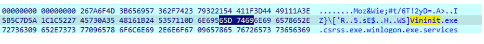 
  <i>Figure 23: after encryption of **w**</i>

  
  

This encryption is **invertible**, since:  
  
\- we know the key  
  
\- we know from which character of the key it started (the first one)  
  
\- we know that it advances the chars of the key one by one, wrapping up every 16 chars  
  
\- we know that XOR operation is invertible  
  
## Communication with C2 Server
  
The next interesting thing is the communication with the command-and-control server.  
  
The sample communicates with the server using Microsoft APIs `InternetOpenA`, `InternetConnectA` and `HttpOpenRequestA`.  
  
The **URL** of the C2 server is **www.celasllc.com**. In particular, the sample tries to access the resource _www.celasllc.com/checkupdate.php_, as we can see from the the following screenshot, where:  
  
\- `[ebp+szObjectName]` holds the string `/checkupdate.php`  
  
\- `[ebp+szServerName]` holds the string `www.celasllc.com`  
  

  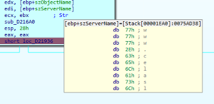 
  <i>Figure 24: C2 server</i>

  
  

The **Header** of the HTTP request that I observed is the following:  
  

Accept: image/gif, image/x-xbitmap, image/jpeg, image/pjpeg, application/x-shockwave-flash, \*/
Accept:text/html, application/xhtml+xml, \*/\* 
User-Agent: Mozilla/5.0 (compatible; MSIE 10.0; Windows NT 6.1; Trident/6.0) 
Host: www.celasllc.com
Connection:Keep-Alive
Accept-Encoding:gzip, deflate
Content-type: multipart/form-data;boundary=jeus
Content-length: 2301
                          

  
Note the special separator (**boundary=jeus**) and the fact that the sample is pretending to send a GIF file. Indeed, the sample refers to the transferred data as if they were an image file named **temp.gif**.  
  
Finally, for what concerns the content sent to the C2 server, the sample sends the string **"GIF89a"** (image header), followed by the encryption key **“Moz&Wie;#t/6T!2y,"** and the encrypted content previously computed.  
  

  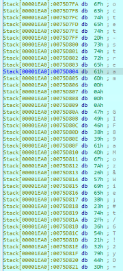 
  <i>Figure 25: HTTP content</i>

  

After that, if the sample receives a successful response from the C2 server, it calls `CryptStringToBinaryA` with `dwflags` equal to 1 (corresponding to `CRYPT_STRING_BASE64`) to decode the base64-encoded string from the C2 server.  
  

  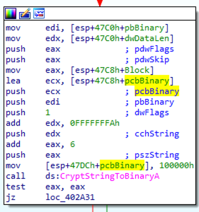 
  <i>Figure 26: base64 decode</i>

  
  

Then, RC4 algorithm is used to decode the data received from the C2 server.  
  
## Encryption #2: RC4
  
RC4 is a stream cipher encryption algorithm, that is a _symmetric key cipher where plaintext digits are combined with a pseudorandom cipher digit stream (keystream). In a stream cipher, each plaintext digit is encrypted one at a time with the corresponding digit of the keystream, to give a digit of the ciphertext stream_ ([Wikipedia](https://en.wikipedia.org/wiki/Stream_cipher)).  
  
_To generate the keystream, the cipher makes use of a secret internal state which consists of two parts:  
  
1\. A permutation of all 256 possible bytes (denoted "S" below).  
2\. Two 8-bit index-pointers (denoted "i" and "j").  
  
The permutation is initialized with a variable-length key, typically between 40 and 2048 bits, using the key-scheduling algorithm (KSA). Once this has been completed, the stream of bits is generated using the pseudo-random generation algorithm (PRGA)._  
  
So, there are two main components involved in this algorithm: the Key-Scheduling algorithm, used to initializa the permutation in the array **S**, and the Pseudo-random generation algorithm (PRGA), which outputs a byte of the keystream at each iteration.  
  
Now we will take a look at the pseudocode of these two algorithms and we will try to match them with the reversed code from IDA.  
  
## Key-scheduling algorithm (KSA)
  
This is the pseudocode of the KSA:

1  for i from 0 to 255
2      S\[i\] := i
3  endfor
4  j := 0
5  for i from 0 to 255
6      j := (j + S\[i\] + key\[i mod keylength\]) mod 256
7      swap values of S\[i\] and S\[j\]
8  endfor			  

  
Figure 27 corresponds to lines 1 and 2: indeed, **S\[i\]** is assigned the value **i**, for i that ranges from 0 to 255 (100h is 255 in decimal).  
  

  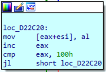 
  <i>Figure 27: initialization of S array</i>

  
  

In figure 28 we can see part of the initialization of the S array, where the memory is assigned consecutive values from 0 to 255.  
  

  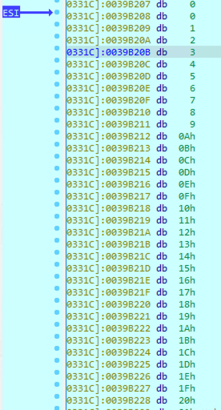 
  <i>Figure 28: S array initialized</i>

  

In figure 29 we can see that each character of the string is read, XORed with the S array, and written back to memory (corresponding to line 6)  
  

  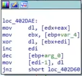 
  <i>Figure 29: XOR between char and S</i>

  
  

In figure 30 we can see a block that corresponds to `key[i mod keylength])`, indeed we see that a different char of the key is extracted based on the index, modulus the length of the key, which is 18 (or 12 in hex)  
  

  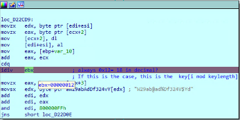 
  <i>Figure 30: key modulus length</i>

  
 

The swap operation (line 7) is shown in figure 31. **EDX** and **EAX** registers are used to temporarily store the values that are going to be swapped.  
  

  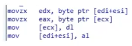 
  <i>Figure 31: swap operation</i>

  
  

## Pseudo-Random Generation Algorithm (PRGA) 
  
IDA disassembles the PRGA in another block (KSA is implemented by function _sub\_D22C00_, while PRGA is implemented by function _sub\_D22D40_).  
The pseudocode for PRGA is shown in figure 32:  
  

  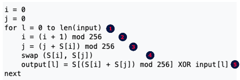 
  <i>Figure 32: Pseudo-Random Generation Algorithm (PRGA)</i>

  
  

Now, I'll do my best to match each line of the pseudocode with the actual blocks shown in IDA:  
  
1\. The loop iterates from the first char up to the last one. We can see this in figure 33, where the jump is taken (_i.e._another iteration of the loop is repeated) as soon as there are characters to decrypt  
  

  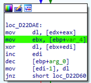 
  <i>Figure 33: loop in PRGA</i>

  
  

2\. **i** is implemented using register **ECX**. It is incremented by one at each iteration and restarts from zero each time it reaches 256 (`and ecx, 800000FFh`)  
  

  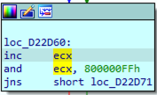 
  <i>Figure 34: variable **i** in a PRGA iteration</i>

  

  

3\. **S\[i\]** is implemented by the memory location at address **\[ecx + eax\]**, **j** is implemented using register **EDX** and finally `mod 256` is implemented by the `and` operation  
  

  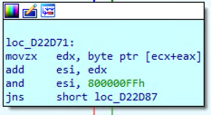 
  <i>Figure 35: variable **j** in a PRGA iteration</i>

  

  

4\. The swap of **S\[i\]** and **S\[j\]**  
  

  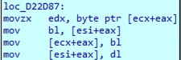 
  <i>Figure 36: swap operation</i>

 

5\. **(S\[i\] + S\[j\]) mod 256**  
  

  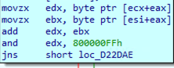 
  <i>Figure 37: (S\[i\] + S\[j\]) mod 256</i>

 

The XOR between the ciphertext and the key is applied and the decrypted char is written back to memory  
  

  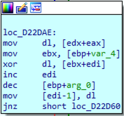 
  <i>Figure 38: the decrypted char is written to memory</i>

 
 

This concludes the encryption capabilities of this sample attributed to the North Korean Lazarus group.  
  
Other functionalities are present, whose analysis is omitted because they are not related to the encryption capabilities of the sample.  
  
The only thing that I want to add is that this sample does not worry too much about hiding its tracks: once launched with the correct command-line argument, it remains constantly running, executing a `sleep` of 0x7530 = 30.000 ms = 30 seconds when it is not communicating with the C2 server or doing other stuff.  
  
  
  

  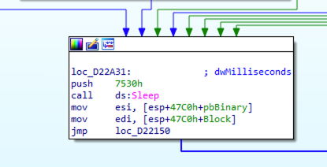 
  <i>Figure 39: sleep</i>

 

  

## Conclusions
  
We deeply analyzed a sample attributed by CISA to the Lazarus group, mainly focusing on its encryption capabilities.  
  
We saw that the sample implements two custom encryption algorithms:  
\- the first one is a simple XOR-based encryption algorithm, used to communicate the information gathered about the infected system to the C2 server  
\- the second one is a custom implementation of the RC4 algorithm, a stream-based encryption algorithm used to decrypt the instructions received from the C2 server.  
  
Although resources about this sample already exist (notably the one from CISA), the aim of this blog is to provide a much more detailed analysis about the encryption algorithms used by the Lazarus group, analyzing them in depth and explaining all the relevant parts in the disassembled code.  
  
## Indicators of Compromise
  
You can refer to [CISA IOCs](https://www.cisa.gov/sites/default/files/publications/MAR-10322463-1.v1.WHITE_stix.xml) (stix format).  
  
## References

#### 

*   [Blog post on thebytemachine.com](https://thebytemachine.com/analysis_of_encryption_algs_used_by_north_korean_group_lazarus)
*   [CISA Report](https://www.cisa.gov/news-events/analysis-reports/ar21-048a)
*   [Apple Jeus versions](https://blogs.infoblox.com/cyber-threat-intelligence/cyber-threat-advisory/cyber-threat-advisory-hidden-cobra-applejeus-cryptocurrency-threats/)
*   [Microsoft Developer Network](https://learn.microsoft.com/en-us/windows/win32/)
*   [RC4 Algorithm](https://en.wikipedia.org/wiki/RC4)
